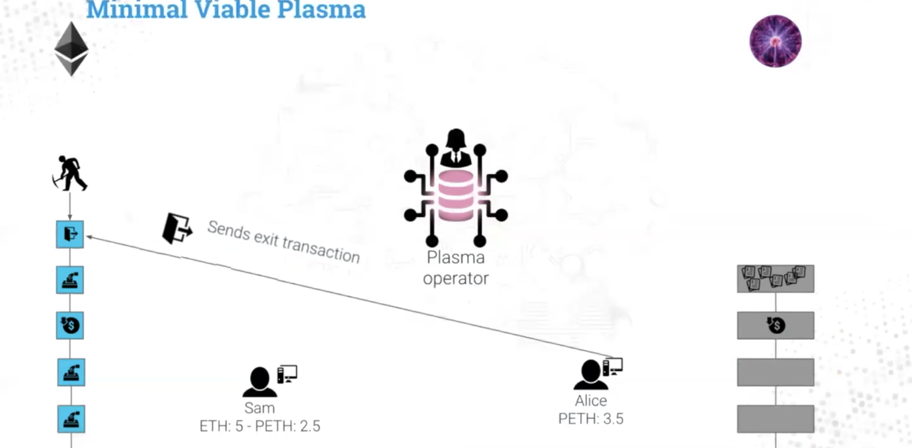

# Express Plasma MVP as javascript

I express Plasma MVP as Javascript for better understanding of my study. MVP is minimal viable plasma which is originally proposed by Vbuterin aiming to provide the basic security properties of Plasma in a very simplified way. 
I mainly use OmiseGo's Plasma implementation as a reference.

## Get started

### Run install command
`npm install`

### Execute flow
`node flow.js` 
If I puck pack all process into flow.js, it will hard to read. So I divide into several branches. Please checkout.

## Simple Withdrawal
Please checkout 'simple-withdrawal' branch and refer to following blog post for further information. 

Blog Post: [Express Plasma MVP as Javascript - Simple Withdrawal](https://medium.com/@t.tak/express-plasma-mvp-as-javascript-simple-withdrawal-53f59bcced3)
 

 
